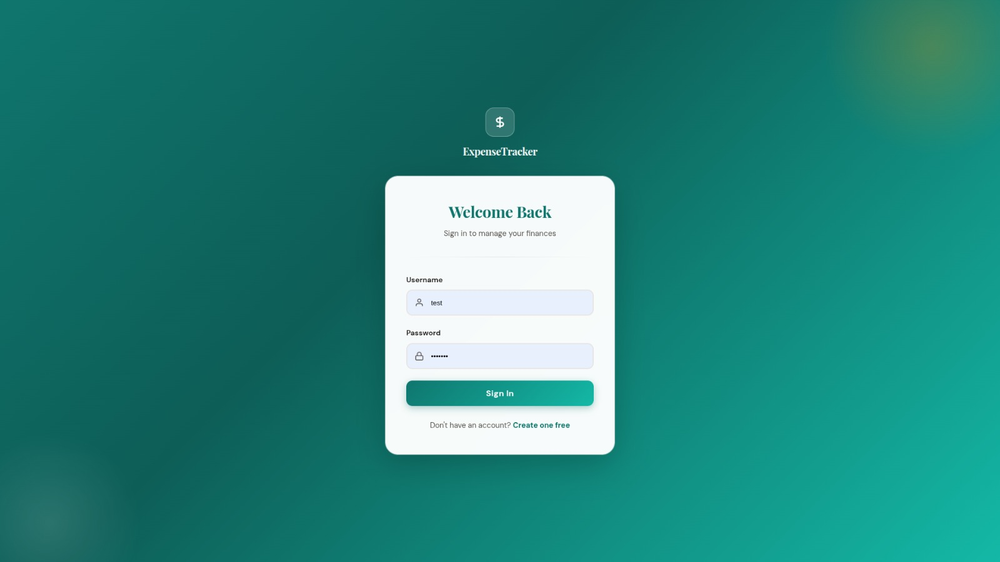
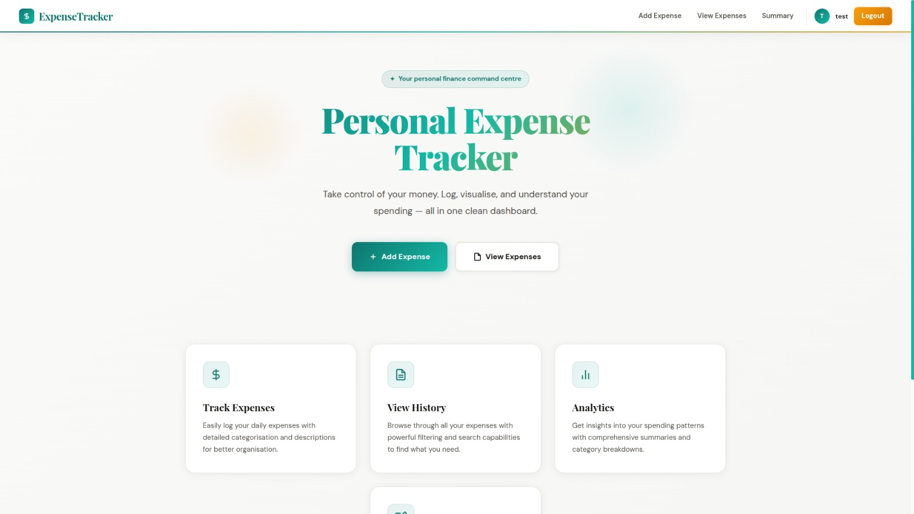
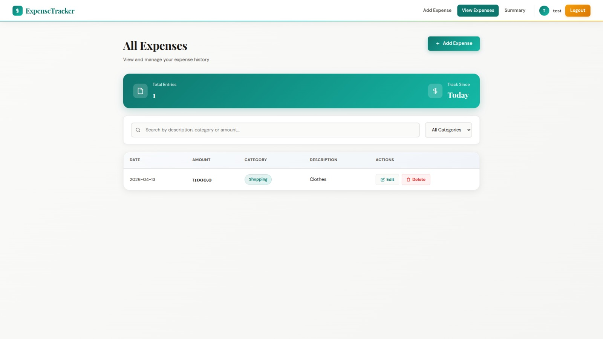
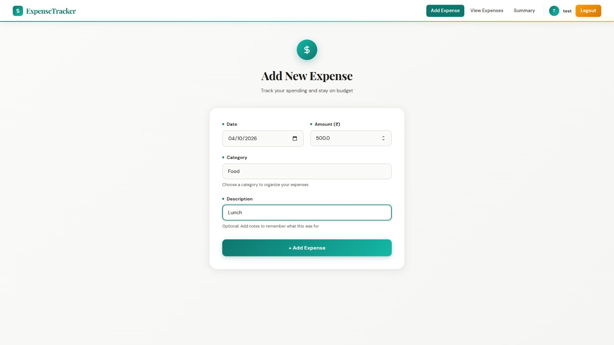
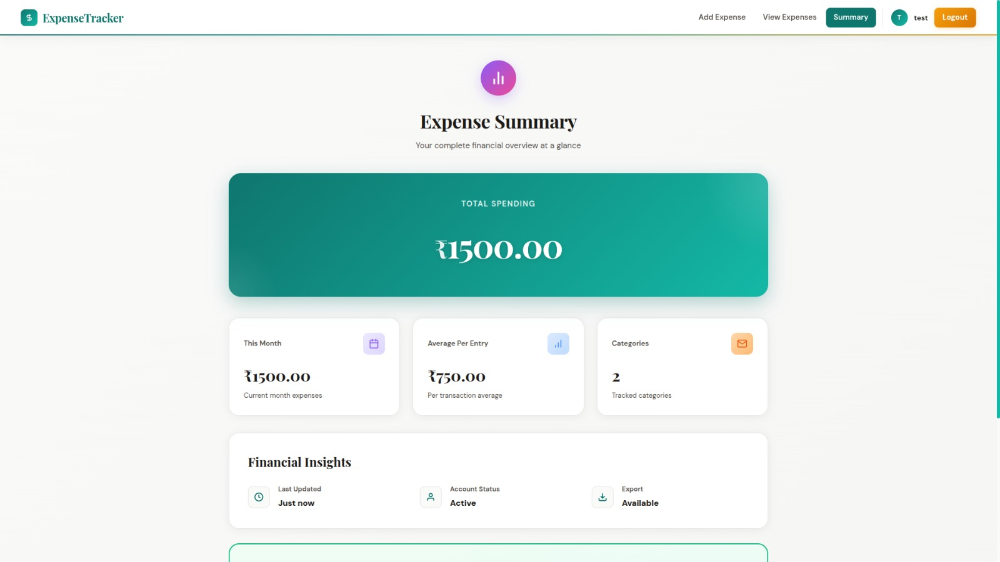
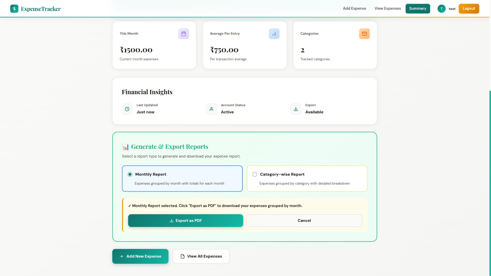
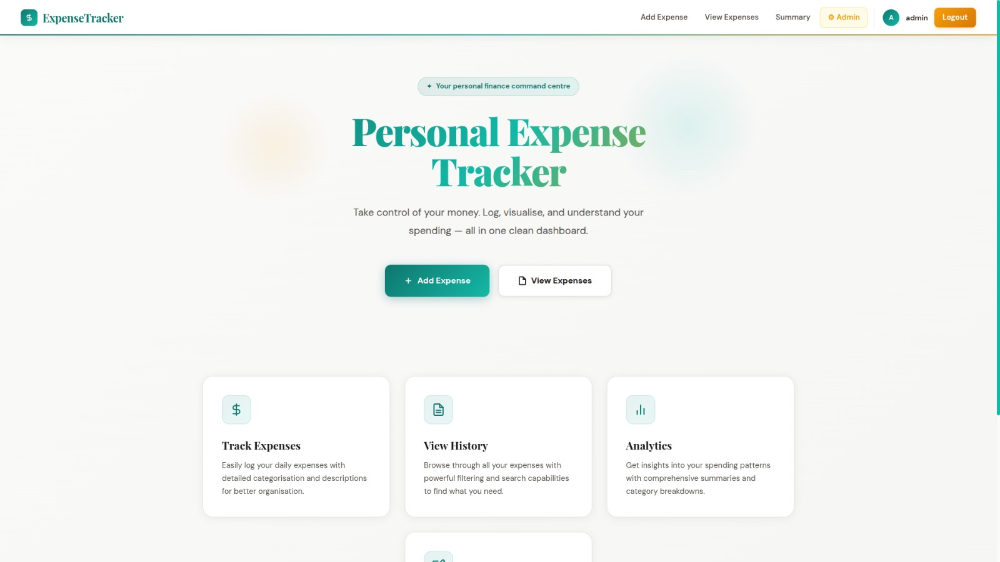
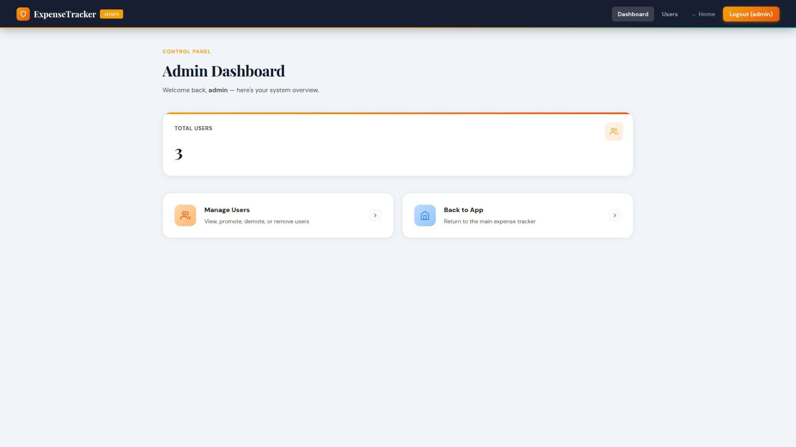
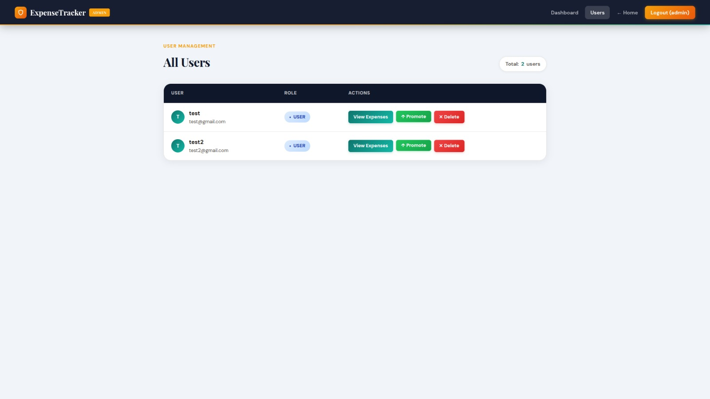

# Multi-User Smart Finance Management System

A full-stack web application built using **Spring Boot, Thymeleaf, and MySQL Database** to manage and track personal expenses with multi-user support, rich data visualization, and admin functionality.

---

## Project Overview

The Smart Finance Management System allows users to securely track their daily expenses while providing administrative oversight.

**Regular Users:**
- Register and login with secure session-based authentication
- Add daily expenses
- View only their own expenses securely (Privacy-first design)
- Edit and delete their entries
- View personal spending summary (Total, average, category count)
- Visualize expenses using interactive Charts (`/chart` endpoint)
- Export and download PDF reports (Monthly or Category-wise) via iText7
- Filter and search their expenses dynamically

**Admin Users:**
- View and manage all users in the system
- Promote/demote users to/from admin role
- View any user's expenses
- Delete user accounts (except their own)

This project follows proper **MVC architecture** and demonstrates core Object-Oriented Analysis and Design (OOAD) principles including the **Adapter Pattern** for report generation, with **multi-user support** and **role-based access control**.

---

## Tech Stack

| Layer        | Technology Used |
|-------------|----------------|
| Backend     | Spring Boot 4.0.2, Java 17 |
| Frontend    | Thymeleaf, HTML5, CSS3, JavaScript |
| Database    | MySQL Server 8+ |
| ORM         | Spring Data JPA (Hibernate) |
| Authentication | Custom Session Management (`SessionManager`) |
| PDF Export  | iText7 Core (Adapter Pattern) |
| Validation  | Jakarta Bean Validation |
| Build Tool  | Maven |

---

## Architecture details

The project strictly follows the **MVC (Model-View-Controller)** pattern with distinct layers:

**Models:**
- `Expense.java` - Expense entity containing amount, description, date, and category.
- `User.java` - User entity mapping account credentials and roles.

**Repositories (DAO Layer):**
- `ExpenseRepository` - Data access for expenses.
- `UserRepository` - Data access for users.

**Services:**
- `ExpenseService` - Business logic for expenses (user-specific filtering and CRUD).
- `ReportService` - Generates PDF reports (Monthly and Category) adapting expense lists into documents.
- `UserService` - Business logic for user management and authentication.

**Controllers:**
- `ExpenseController` - Routes for expense CRUD operations, chart visualization, and PDF generation.
- `AuthController` - Routes for login, registration, and logout.
- `AdminController` - Routes to oversee users, modify roles, and purge accounts.

**Utilities:**
- `SessionManager` - Wraps HTTP Session for session-scoped user management.

---

## Setup & Installation

### 1. Clone Repository
```bash
git clone https://github.com/GSuryaP/Expense-Tracker.git
cd Expense-Tracker
```

### 2. Configure MySQL Database
Open MySQL terminal:
```bash
sudo mysql -u root -p
```

Run the following setup scripts:
```sql
CREATE DATABASE expense_tracker_db;
CREATE USER 'expense_user'@'localhost' IDENTIFIED BY 'password@123';
GRANT ALL PRIVILEGES ON expense_tracker_db.* TO 'expense_user'@'localhost';
FLUSH PRIVILEGES;
EXIT;
```

*(Note: Verify `application.properties` to ensure credentials match what you create above.)*

### 3. Run Application
Use the Maven wrapper or your local Maven installation to build and run the application:
```bash
mvn clean
mvn spring-boot:run
```

### 4. Application Access
- **Home/Dashboard Page:** `http://localhost:8080/`
- **Login Page:** `http://localhost:8080/auth/login`
- **Registration:** `http://localhost:8080/auth/register`
- **Admin Panel:** `http://localhost:8080/admin/dashboard` 

*(A default admin account is automatically generated on the first run with `admin` / `admin123`. Change this immediately for security).*

---

## Execution Screenshots
<p align="center">
  <br>
  <em>User Login & Authentication Form</em>
</p>

<p align="center">
  <br>
  <em>Main User Dashboard Landing Page</em>
</p>

<p align="center">
  <br>
  <em>Expense History with Search & Filters</em>
</p>

<p align="center">
  <br>
  <em>Interactive Expense Logging Form</em>
</p>

<p align="center">
  <br>
  <em>Financial Overview & Analytics Dashboard</em>
</p>

<p align="center">
  <br>
  <em>PDF Report Generation Interface</em>
</p>

<p align="center">
  <br>
  <em>Admin Dashboard Control Navigation</em>
</p>

<p align="center">
  <br>
  <em>Admin Control Panel Overview</em>
</p>

<p align="center">
  <br>
  <em>User Management for Promotions & Deletions</em>
</p>


---

## Authors
- [G S S Surya Prakash](https://github.com/GSuryaP)
- [Chandan Chatragadda](https://github.com/chandan365c)
- [Drishti Golchha](https://github.com/golchha27)
